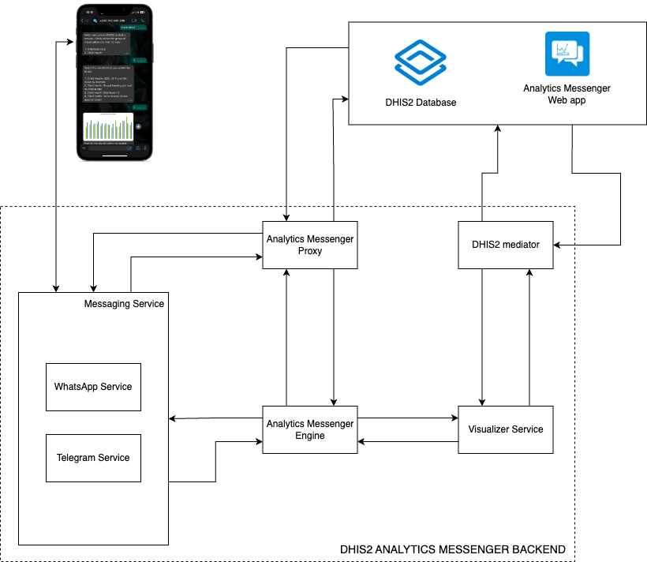

# DHIS2 Analytics Messenger Techical Documentation

## Introduction

The [DHIS2 Analytics Messenger](https://github.com/hisptz/dhis2-analytics-messenger-app) is an innovative application
that gives users easy access to DHIS2 analytics data. Leveraging popular social messaging platforms like WhatsApp and
Telegram, this application allows users to receive DHIS2 analytics effortlessly

The DHIS2 Analytics Messenger offers two distinct methods for accessing analytics data: push analytics and chatbot
functionality. To fulfill the need for more accessible and user-friendly analytics data, this application consists of
two central systems:

- A DHIS2 Analytics Messenger web application for configuration and push analytics distribution.
- A social messaging chatbot for interactive user-driven data access

Working together, these applications create a comprehensive and user-centric DHIS2 Analytics Messenger.

## About this documentation

This documentation provides the system administrator with in-depth knowledge about the DHIS2 Analytics messenger and
instructions for setting up and troubleshooting the application. It contains information about:

- Installation requirements.
- Procedure to install.
- Troubleshooting guides.
- API references.
- Version changelog.
- Contact information

## Installation

In order to get started with setting up the DHIS2 Analytics Messenger, the following are the important requirements that
need to be met:

- Mobile phone number registered as a WhatsApp Business account.
- DHIS2 instance with version 2.38 and above.
- A server with the following:
    - Docker Engine: version 23.0.5 and above
    - Docker Compose Plugin: version v2.15.1 and above
    - Git version control is a conditional requirement.

**_NB_**: Installation of docker engine and docker compose plugin can be found in
the [Docker documentation](https://docs.docker.com/engine/install/).

## Getting Started

The installation process of DHIS2 Analytics messenger involves two major steps, that are:

- Setting up the Back-end server
- Analytics messenger web app installation.

### Backend server setup

The installation of the back-end server has been made easier with the use of docker containers. The following are the
steps to be made to install the DHIS2 analytics messenger backend server

#### Download the installation source code:

The installation source code can be downloaded manually or by using git.

The manual download can be done by downloading a release version from
the [GitHub releases](https://github.com/hisptz/chatbot-backend-setup/releases) and extracting it from the server ready
for the next steps.

This can alternatively be done by using git within the server, with the help of the git clone command as shown below:

```
git clone https://github.com/hisptz/chatbot-backend-setup.git
```

With either of the above approaches, the installation is now ready and available on the server and can be accessed by
navigating to the downloaded (extracted) folder.

#### Setting up the configurations:

Since the DHIS2 analytics messenger is a decoupled system, it has a couple of configurations that need to be done for
all the sub-services associated with it.

The configurations can be set by creating a `.env` file with contents similar to the `.env.example` file that can be
found in the downloaded installer. The variables to change for basic configuration
are `DHIS2_BASE_URL`, `DHIS2_USERNAME`, or `DHIS2_API_TOKEN`. The `PROXY_API_MOUT_POINT` variable can also be changed in
case one wants to have a different context from the default one (**analytics-messenger**). The database credentials can
also be changed. The database credentials changes should also be done on the database URL of the engine service.

Otherwise, the others should be left as in example files unless needed to be changed. More explanation of the variables
is given below.

These variables to set up can be classified into:

- **Whatsapp service**

  This is a WhatsApp gateway service, that allows receiving and sending of WhatsApp messages. It requires the following
  variables:
  `WHATSAPP_MESSAGE_HANDLER_GATEWAY` - A server that handles WhatsApp incoming messages (in this case it is the chat-bot
  server).
  `ALLOWED_CONTACTS`- A list of whitelisted phone numbers. The WhatsApp service will only read incoming messages from
  these numbers. Leave this empty if you want to reply to all phone numbers.

- **Postgres DB service**

  This is an internal service required by the ChatBot service. It is mainly used for the management of conversation flow
  and push analytics scheduling. It requires the following variables:

  `POSTGRES_PASSWORD` - Database password

  `POSTGRES_USER`- Database user

- **Chat-bot service**

  This is a simple server that uses a decision tree-based algorithm to perform different actions based on the user
  selection. It is responsible for handling user input from the messaging services such as the WhatsApp service. The
  chat-bot service requires the following variables:

  `DATABASE_URL`- a Url to the database (db service) in the
  format `postgres://<POSTGRES_USER>:<POSTGRES_PASSWORD>@server_name:port/core`

  `API_MOUNT_POINT` - A path from which the ChatBot service will be accessible. For example, if set to `/api` then the
  service will be available at `http://localhost:3000/api`

- **DHIS2 Mediator service**

  This is a service that connects to a DHIS2 instance and exposes APIs without requiring DHIS2 authentication. Variables
  required for this service include:

  `DHIS2_BASE_URL` - URL to DHIS2 instance

  `DHIS2_USERNAME` - User to authenticate as (**DISCLAIMER: THIS SHOULD BE A USER WITH ONLY REQUIRED ROLES!**)

  `DHIS2_API_TOKEN` - PAT token (can be used instead of the password. Takes preference)

  `DHIS2_PASSWORD` - Password to authenticate with.

  `ALLOWED_RESOURCES` - A list of resources that the API exposes.

  `READONLY_RESOURCES` - A list of resources that the API treats as read-only (Will not allow to update/create the
  resource)

- **DHIS2 Visualizer service**

  This is a server that generates an image of a visualization. Variables required are

  `API_MOUNT_POINT` - A path from which the core service will be accessible. For example, if set to `/api` then the
  service will be available at `http://localhost:3000/api`

  `DHIS2_MEDIATOR_URL` - Url to the DHIS2 mediator service

  All these should be left to their default values.

#### Starting the backend services:

After the configurations are set, all the Analytics messenger backend services can be initialized by running the
following commands inside the installer folder.

```
sudo ./startup-service.sh follow
```

sudo ./startup-service.sh follow

This will pull all the required docker images and start the services. It might take some time for the first time. If it
completes successfully, all the services will be up and running and it will be available under port `4040` on your
server. (**make sure to set this port available, to be able to access the services**)

There will be a QR code printed on the logs. On the WhatsApp phone, go to the linked devices menu and select to add a
new [linked device](https://faq.whatsapp.com/1317564962315842/?cms_platform=web). When prompted to scan a QR Code, scan
the one on the logs. If the scan is successful, the phone will show a login notification. Your WhatsApp service has been
successfully set up.

For easy usage, it is advised that the WhatsApp account that is linked with the DHIS2 Analytics Messenger should be a
WhatsApp Business account. Nevertheless, Analytics Messenger can also work with a normal account but this should be on a
low-traffic basis (at least less than 30 users) system.

The container will exit after **_about 3 minutes_**. If the WhatsApp account is not linked. If this happens, run the
start script as before.

After setting up whatsapp, you can exit the log screen by pressing CTRL + C keys.

You might need to restart services in case of any changes on `.env` file or need for resart. You can do this by running;

```
sudo ./restart-service.sh
```

To see if all services are running, run below command

```
sudo ./list-service.sh
```

The above service will have 6 services running, `db`, `whatsapp`, `chat-bot`, `mediator`, `visualizer` and `proxy`

In case you wish to stop all service, run below command

```
sudo ./stop-service.sh
```

#### Setting up the reverse proxy:

To connect your backend to the [Analytics Messenger App](https://github.com/hisptz/dhis2-analytics-messenger-app) create
a new gateway in the gateway configuration tab. Input the proxy service `PROXY_BASE_URL` as the URL and the proxy API
key as the `PROXY_API_KEY` value

#### View logs for chatbot service:

Available services are `db`, `whatsapp`, `chat-bot`, `mediator`, `visualizer` and `proxy`. To access logs for any
particular service, you can use the following command, specifying the desired service for which you wish to view logs,
for instance whatsapp

```
sudo ./view-logs whatsapp
```

### Analytics messager web application installation

The Analytics Messenger web app can be installed manually by downloading the preferred version from
the [Github releases](https://github.com/hisptz/dhis2-analytics-messenger-app/releases). This will download the zipped
file which can be manually installed into a DHIS2 instance.

After installation, the configurations can be set using
the [Analytics messenger user guide](https://docs.google.com/document/d/1YmExEPHvrP9cPs9i7L9Z8dX-mZ_2uvSd-tZerOzazls/edit?usp=sharing).

It should be noted that to connect your backend to the Analytics Messenger App create a new gateway in the gateway
configuration tab. assign gateway URL to point to the exposed WhatsApp endpoint of the server backend.

## Architecture and Design

The below diagram explains the in-depth architecture of DHIS2 Analytics Messenger:



The DHIS2 is mainly divided into two sections:

- Analytics Messenger web application: This is a client-based web application that can be installed in the DHIS2
  instance and used for configuration and push analytics functionalities of the DHIS2 Analytics Messenger.
- Analytics Messenger backend: This is the server-side application that manages all the business logic for communication
  with the social messaging platforms, conversation flows for the chatbot services, and scheduling of the push analytics
  configured by the web application.

Analytics Messenger's backend is subdivided into 5 major sub-services that make up the whole architecture.

- Analytics Messenger Proxy

  This is the proxy server that exposes the Analytics Messenger services outside the server. Only the allowed services
  by the Analytics messenger proxy can be accessed outside the server.

- Visualizer Service

  The Visualizer service is responsible for the generation of the analytics visualizations from the DHIS2 instance to be
  used by either the core or the Analytics Messenger web application for push analytics.

- DHIS2 Mediator

  This is the service that allows the **Visualizer service** to access the DHIS2 instance without authentication. It
  abstracts the authentication process while also whitelisting the resources that can be accessed.

- Messaging service

  This is the service that allows sharing of the analytics through social messaging platforms. As of this version, it
  can be configured to utilize **WhatsApp** as the messaging platform.

- Analytics Messenger Engine

  This is the core engine of Analytics Messenger that mainly handles the Scheduling of the push analytics and the
  conversation flow of the chatbot.

## Troubleshooting and FAQs

The following are some of the frequently asked Questions and troubleshooting tips for using the DHIS2 Analytics
messenger:

- **Running the service alongside DHIS2 managed by lxc script**

  If you want to host your analytics messenger in the same server as your DHIS2 and have used the lxc tool then view
  this [detailed guide](lxd_setup.md)

- **Why is it advisable to use WhatsApp business number?**

  WhatsApp business account provide smooth usage of the by omitting the challenge of the number to be banned due to high
  traffic. This is in contrast to the normal WhatsApp account which works but with traffic limitations.

- **Does Deleting a push analytics in the Analytics Messenger web application deletes the schedule?**

  Yes, if a push analytics is deleted then all the schedules associated with it are deleted.

- **Fail to instantiate and run installation inside lxc container**

  In case you want to install inside the container specified using lxc container, you might need to
  set `security.nesting=true`. Below are commands you need to run assuming you container is `deploy-container`.

  ```
  lxc stop deploy-container
  lxc config set deploy-container security.nexting true
  lxc start deploy-container
  ```

## Updates and Changelogs

The DHIS2 Analytics Messenger version **1.0.0- Beta1** has the following features included:

- Support for WhatsApp service connection.
- Support for configurations for
    - Analytics messenger gateway
    - Accessible visualizations
- Support for push analytics
- Support for Scheduling of the push analytics. The supported schedules include:
    - Pre-defined
    - Custom Schedules
    - Cron
- Default conversation flow support for DHIS2 visualization access through the ChatBot

## Contact

For contact and support use the following contact details:

- Email: [Ismail Koleleni](mailto:ismailkoleleni@hisptanzania.org) , [Dev HISPTz](mailto:dev@hisptanzania.org)
- Phone numbers:
- [Community of Practice](https://community.dhis2.org/t/dhis2-analytics-messenger/53477)

